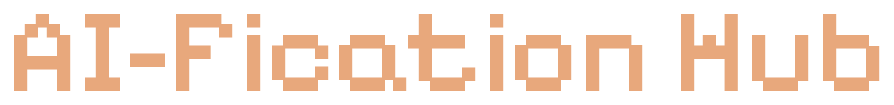
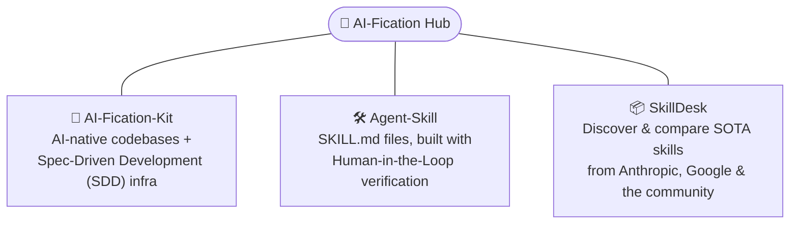

### 🧭 The map for the AI-Fication Ecosystem

**Provenance-tagged, Verifiable AI outputs — From Methodology to Distribution.**

[AI-Fication-Kit](https://github.com/kunalsuri/ai-fication-kit) · [Agent-Skill](https://github.com/kunalsuri/agent-skills) · [SkillDesk](https://github.com/kunalsuri/SkillDeck) · [AI Fluency Quiz](https://github.com/kunalsuri/ai-fluency-quiz)

---

 

## 🧩 What is this?

AI-Fication Hub is the MAP for the AI-Fication Ecosystem.

> 🧱 **AI-Fication-Kit** provides the core methodology — provenance-tagged, verifiable outputs.

> 🛠️ **Agent-Skill** provides a set of `SKILL.md` files built by community authors (such as @kunalsuri et al.) using the latest SOTA AI-powered tools, with Human-in-the-Loop verification.

> 📦 **SkillDesk** curates information about different `SKILL`s spread across repositories from Anthropic, Google, and the community. This tool makes understanding and consuming diverse skills easy for both new and experienced AI-native users.

This repo explains how the pieces connect and how to use them together. **It doesn't ship code — it's the front door.**

 

## 🔗 The Ecosystem, Connected but Independent

 

## 🚦 Use What You Need!

- **Building Code / Reports and need SKILLs?** Grab `SKILL.md` files straight from **Agent-Skill** — no setup elsewhere required.
  
- **Exploring what's out there in different SKILLS?** Browse **SkillDesk** to see the state of the art across Anthropic, Google, and community-built skills.

- **Making your Codebase AI-native and use SDD?** Start with **AI-Fication-Kit** for the methodology and infrastructure behind Spec-Driven Development (SDD).

 

NOTE: They're built to reinforce each other, but none is a prerequisite for the others — pick the entry point that matches what you're trying to do.

 

---

## 📦 More about the Repos

| Repo | What it does | Link | Status |
|---|---|:---:|:---:|
| 🧱 **AI-Fication-Kit** | Core methodology layer. Defines the provenance-tagging approach for marking content `[inferred]` vs `[verified]`. | [ai-fication-kit](https://github.com/kunalsuri/ai-fication-kit) | 🟢 Active |
| 🛠️ **Agent-Skill** *(incl. Agent-Skill-Doctor)* | Authors and validates `SKILL.md` agent skill definitions, applying the Kit's provenance model to skill creation. | [agent-skills](https://github.com/kunalsuri/agent-skills) | 🟢 Active |
| 📦 **SkillDesk** | Curates and distributes validated skills produced by Agent-Skill — the downstream consumer of the pipeline. | [SkillDeck](https://github.com/kunalsuri/SkillDeck) | 🟢 Active |

 

## 🧠 The 'AI Fluency Quiz' - How AI-Native Are You?

**[AI Fluency Quiz](https://github.com/kunalsuri/ai-fluency-quiz)** repo provide a tool for a free, open-source self-assessment to assist students, builders, and leaders to find out how AI-native they are.

- ⏱️ Pick your role and available time, then work through questions spanning multiple topic banks — foundations, LLMs, transformers, prompting, RAG, agents, safety, ethics, fine-tuning, and more — across beginner to expert tiers.
- 📚 Every answer comes with an honest explanation and cited sources, not just a right/wrong verdict.
- 📄 Get a personalized cheat sheet and reading list ("The Frontier") targeting your specific knowledge gaps.
- 🔒 Privacy-first: zero storage, zero tracking, zero external requests after the page loads — everything runs client-side.

It's a standalone project (not part of the AI-Fication pipeline above), but it shares the same spirit: helping people honestly gauge and grow their AI fluency. 

 

🔗 It's Online, Try it at:  https://ai-fluency-quiz-rust.vercel.app/

 

---

## 🔗 Links & 📖 Glossary of Terms

- 🧱 [AI-Fication-Kit](https://github.com/kunalsuri/ai-fication-kit) — the methodology
- 🛠️ [Agent-Skill](https://github.com/kunalsuri/agent-skills) — the tooling
- 📦 [SkillDesk](https://github.com/kunalsuri/SkillDeck) — the distribution layer
- 🧠 [AI Fluency Quiz](https://github.com/kunalsuri/ai-fluency-quiz) — self-assess how AI-native you are

 

## 📖 Glossary of Terms

<strong>Click to Expand Key Terms</strong>

 

| Term | Meaning |
|---|---|
| **`[inferred]`** | Content generated by a model that hasn't been human-checked. Treat it as a draft, not a fact. |
| **`[verified]`** | Content a human has reviewed and confirmed. Safe to build on. |
| **Provenance tagging** | The practice, defined by AI-Fication-Kit, of marking every piece of generated content as `[inferred]` or `[verified]` so downstream consumers know how much to trust it. |
| **`SKILL.md`** | A file that defines an agent skill: what it does, when to use it, and how to invoke it. Authored and validated via Agent-Skill. |
| **Skill** | A packaged, reusable capability for an AI agent, described by a `SKILL.md` file and (optionally) supporting scripts/resources. |
| **Pipeline** | The end-to-end flow of a skill through the ecosystem: methodology (Kit) → authoring/validation (Agent-Skill) → curation/distribution (SkillDesk). |

 

---

## 📄 Acknowledgments & License

The **AI-Fication Hub** project is open-source and licensed under the [Apache License 2.0](LICENSE) — Copyright © 2026 Kunal Suri ([@kunalsuri](https://github.com/kunalsuri)) (CEA LIST).

**Warranty & Liability Notice**: This software is provided under the Apache License 2.0 on an "AS IS" basis, without warranties or conditions of any kind, either express or implied. To the extent permitted by the license and applicable law, the authors and contributors disclaim warranties and limit liability. Please refer to the LICENSE file for the complete terms, including Sections 7 (Disclaimer of Warranty) and 8 (Limitation of Liability). See the LICENSE file for the full license text.
